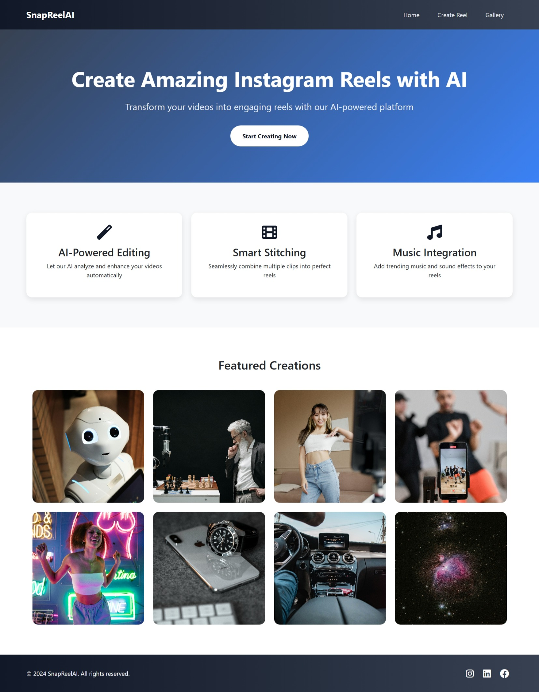
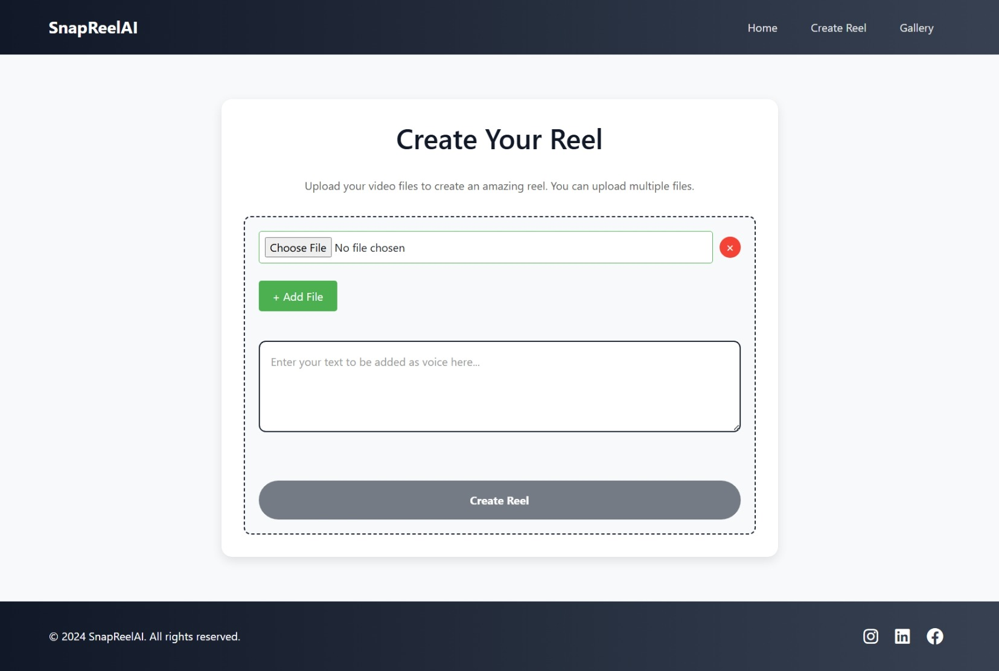
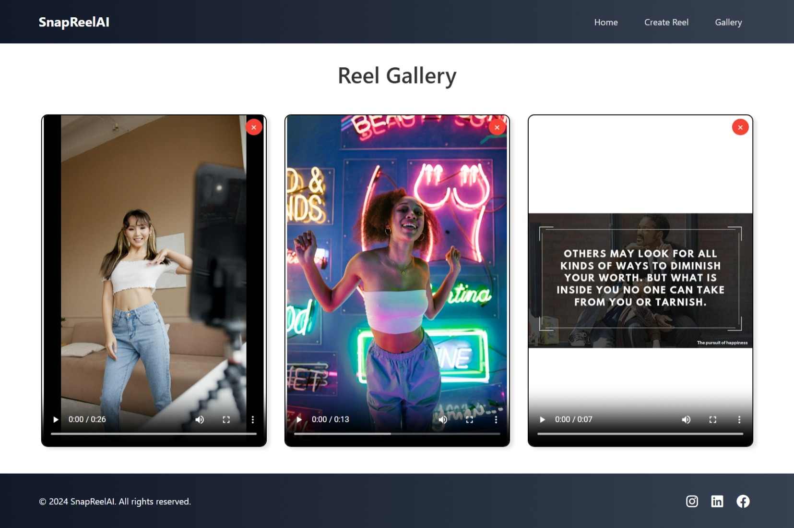

# SnapReelAI
**SnapReelAI** is an **AI-powered Reel Generator** built with **Flask**.  
Users can upload multiple **images** and provide **text**, which is automatically converted into speech using AI Text-to-Speech (TTS). The app then generates a complete **video reel** by combining the uploaded images with the generated audio.  

---

Features
- 🖼️ Upload multiple **images** to be used as reel slides.  
- 🗣️ Enter text → automatically converted into **AI voiceover**.  
- 🎬 Generates a **video reel** by combining uploaded images + audio.  
- 📂 Generated reels are saved and displayed in a **Gallery** for playback.  
- ❌ Delete unwanted reels directly from the gallery.  
- 🔔 Desktop notification when a reel is successfully generated.  
- 🌐 Clean, minimal, and responsive UI built with **Flask templates (HTML + CSS)**.

---

## 📸 Screenshots

### 1. Homepage  
The landing page shows featured creations and details about SnapReelAI.  
A **Start Creating Now** button redirects to the Create Reel page.  



---

### 2. Create Reel Page  
Upload multiple images and enter the text you want to be narrated.  
Click **Create Reel** to generate your AI-powered reel.  



---

### 3. Gallery Page  
All generated reels are displayed here. You can preview, play, and delete them anytime.  



---

## ⚙️ Installation & Setup

### 1. Clone the repository
```bash
git clone https://github.com/your-username/snapreelai.git
cd snapreelai
